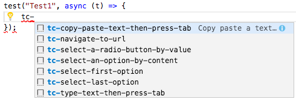

# Code snippets for TestCafe

This Visual Studio Code Extension provides code snippets for TestCafe.

Use the `tc-` prefix to access all snippets:

## Supported languages (file extensions)

* JavaScript (.js)
* TypeScript (.ts)

